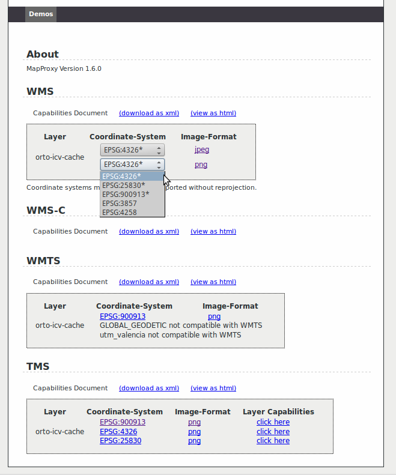

.. _ejer01:

===============================
Acelerar el acceso a un WMS
===============================

Te sugerimos que para resolver los ejercicios inicies un proyecto
nuevo llamado *ej01*::

    $ cd /home/user/mapproxy-workshop/confs/
    $ mapproxy-util create -t base-config ej01
    $ cd ej01
    $ leafpad mapproxy.yaml &

y borres el contenido del archivo usando la combinación de
teclas :kbd:`Control+A` y después la tecla :kbd:`Supr`.

Primera parte: acceder a un servicio de ortoimágenes
------------------------------------------------------

Supongamos que trabajamos en una oficina con un acceso restringido a Internet.
Vamos a crear un *proxy* a la capa ``odcv05_etrs89h30_2010`` ofrecida por el Instituto Cartográfico Valenciano en su servicio de ortofotos
http://terramapas.icv.gva.es/odcv05_etrs89h30_2010. En concreto vamos a trabajar sobre
la zona de la ciudad de Valencia con las siguientes coordenadas de
rectángulo máximo:

- Longitud mínima: -0.45
- Latitud mínima: 39.26
- Longitud máxima: -0.26
- Latitud máxima: 39.56

Te recordamos que para lanzar un servidor debes usar la orden::

    $ mapproxy-util serve-develop mapproxy.yaml

y para pararlo se debe pulsar la combinación de teclas :kbd:`Control+C`.

   Servicio de demostración del proxy de nuestro WMS

Segunda parte: cachear un servicio de ortoimágenes
-----------------------------------------------------

En nuestra oficina hay un cierto número de técnicos que necesitan acceder a
diario a un servicio de ortoimágenes por WMS. Sería muy conveniente que
pudiéramos almacenar una *cache* de dicho servicio para que el acceso a esta
información fuera más rápida y eficiente, ahorrando además una considerable
cantidad de ancho de banda a nuestra organización (y procesamiento al ICV).

Trabajaremos con el mismo servidor, capa y extensión del ejercicio anterior por lo
que el *service* configurado nos servirá sin hacer cambios.

El ejercicio por tanto consiste en crear una configuración de MapProxy que
ofrezca una capa que almacene *caches* en los sistemas ``EPSG:900913`` y
``EPSG:4326`` de esta capa del servicio WMS del ICV para la zona delimitada. El
servidor WMS debe ofrecer además de estos dos sistemas de referencia, también en
el más estándar ``EPSG:3857`` y también en UTM30N, es decir en ``EPSG:25830``.

   Servicio de demostración de nuestra capa cacheada

.. tip:: Puedes ver cómo se configuran los *grids* en el
         `apartado correspondiente <http://mapproxy.org/docs/1.6.0/configuration.html#id5>`_
         de la documentación de MapProxy.

.. tip:: Resulta conveniente definir en el origen los dos sistemas de
         coordenadas soportados por el servidor WMS ``EPSG:4326`` y
         ``EPSG:25830`` (`documentación <http://mapproxy.org/docs/1.6.0/sources.html#wms>`_).

.. attention:: Con esta configuración recomendada, ¿qué *cache* se rellenará
               al pedir teselas en el sistema ``EPSG:900913``? ¿Sabrías decir
               por qué?

Como nuestros técnicos usan a menudo cartografía en coordenadas UTM, sería
interesante que crearas una *cache* expresamente para ese sistema de coordenadas,
de forma que MapProxy no tenga que reproyectar las teselas todo el tiempo.

	 TMS de la ortofoto del ICV

.. note:: Por defecto las cachés hemos visto que se almacenan en formato :file:`png`.
          Esta *cache* es de una ortofoto por lo que parece más adecuado utilizar el
          formato :file:`jpeg` para almacenar y transmitir nuestras teselas. ¿Cómo
          configuramos MapProxy para que nuestra *cache* se almacene en este formato?

Tercera parte: cachear las teselas de OpenStreetMap
------------------------------------------------------

`OpenStreetMap <http://osm.org>`_ es la mayor base de datos de información
geográfica generada por la comunidad. Este proyecto proporciona teselas que
podemos utilizar en nuestros proyectos, siempre que sigamos su `licencia
<http://opendatacommons.org/licenses/odbl/>`_.

El ejercicio consiste en añadir a nuestro servicio para la zona de Valencia una
nueva capa con las teselas de OSM. Para ello definiremos una nueva capa, un
nuevo servicio, una nueva *cache* y un nuevo *grid* de acuerdo a las
especificaciones de OSM. Podemos usar como base la configuración que ofrece el
proyecto en su `wiki <http://wiki.openstreetmap.org/wiki/MapProxy_setup>`_ pero
hay que trabajar un poco más para conseguir que nuestra capa se centre en la
ciudad de Valencia.

	 WMS de OpenStreetMap servido en UTM 30N
