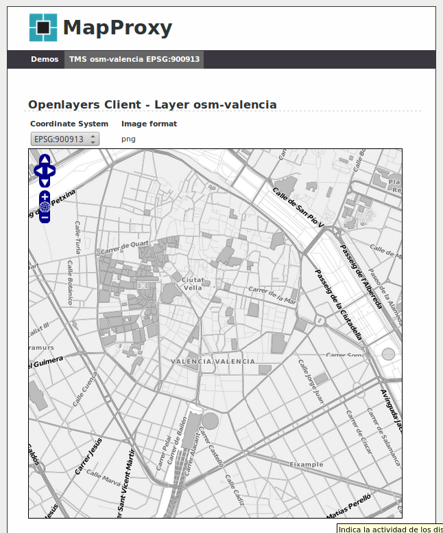
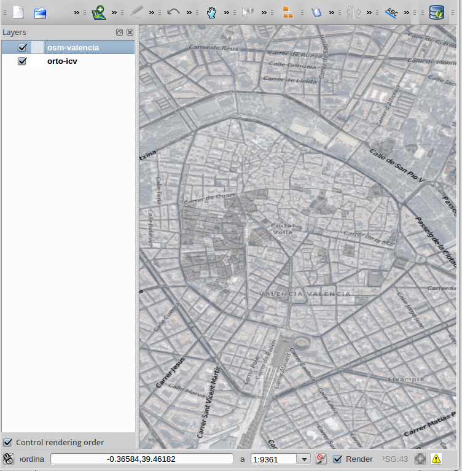

.. _ejer03:

=====================================================
Servir un fichero *MBTiles* creado con TileMill
=====================================================

Te sugerimos que para resolver los ejercicios inicies un proyecto
nuevo llamado *ej03*::

    $ cd /home/user/mapproxy-workshop/confs/
    $ mapproxy-util create -t base-config ej03
    $ cd ej03
    $ leafpad mapproxy.yaml &

y borres el contenido del archivo usando la combinación de
teclas :kbd:`Control+A` y después la tecla :kbd:`Supr`.

.. attention:: Para este ejercicio deberás emplear un archivo con la
   configuración trabajada en el :ref:`ejer01`.

.. note:: Puedes copiar el archivo :file:`mapproxy.yaml` del :ref:`ejer01` o
   descargarlo de `aquí <https://raw.github.com/geoinquietosvlc/mapproxy-workshop/feature/cfp_2014/exercises/wms/mapproxy.yaml>`_.

El objetivo de este ejercicio es montar una capa en MapProxy que sirva una
*cache* en formato MBTiles_ generada en TileMill_. Es decir, realizamos todo
el proceso de diseño cartográfico con esta herramienta y después ofrecemos a
nuestros usuarios dicho trabajo con cualquiera de los servicios de MapProxy,
aunque como es normal, se tendrán los mejores resultados en clientes que
consuman directamente la *cache* sin tener que *resamplear* las teselas al
tratarse de un dato vectorial.

.. note:: TileMill_ es una aplicación de *software* libre para el diseño de
          cartografía usando un lenguaje similar a las hojas de estilo CSS
          que se utilizan en diseño *web*. Una de las salidas de TileMill es
          la *cache* en formato MBTiles_.

.. note:: El formato MBTiles_ es en esencia una base de datos SQLite_ con un
          esquema predefinido para almacenar teselas. Tiene la ventaja de ser
          muy compacto porque en un único fichero se pueden almacenar miles de
          imágenes de una forma estandarizada.

.. _TileMill: http://mapbox.com/tilemill/
.. _MBTiles: http://mapbox.com/developers/mbtiles/
.. _SQLite: https://sqlite.org/

El fichero *MBTiles* proporcionado consiste en una capa de la zona de trabajo
del taller en la que se muestran calles y edificios en tonos de gris. El archivo se puede
descargar de `aquí <https://drive.google.com/file/d/0B28vBRfHgG9pcTRJQUl5QlBVcFU/edit?usp=sharing>`_.

El *grid* que define el fichero *MBTiles* es igual que el usado por Google Maps
solo que se han exportado las teselas hasta el nivel 15, es decir::

  grids:
    valencia:
      base: GLOBAL_MERCATOR
      num_levels: 16

Parte única
-------------

Este ejercicio consiste en definir una nueva capa en MapProxy que
apunte a una *cache* que no tiene *sources* (se debe indicar como una lista
vacía porque el elemento es obligatorio). La cache ha configurar es de tipo
``mbtiles`` y hay que indicar la ubicación del fichero que habrá que dejar en la
carpeta :file:`cache_data`.

   TMS de la capa de *parkings* diseñada en TileMill

Te recordamos que para lanzar un servidor debes usar la orden::

    $ mapproxy-util serve-develop mapproxy.yaml

En la siguiente figura se muestran las dos capas accedidas por separado desde un
cliente GIS de escritorio (QGIS) en el que se ha establecido una transparencia
del 35% a la capa de las calles.

   Acceso a las dos capas mediante WMS
