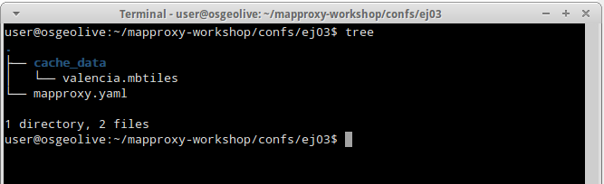
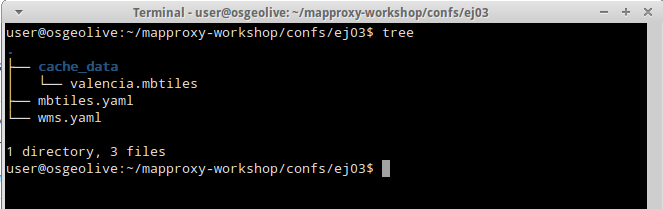
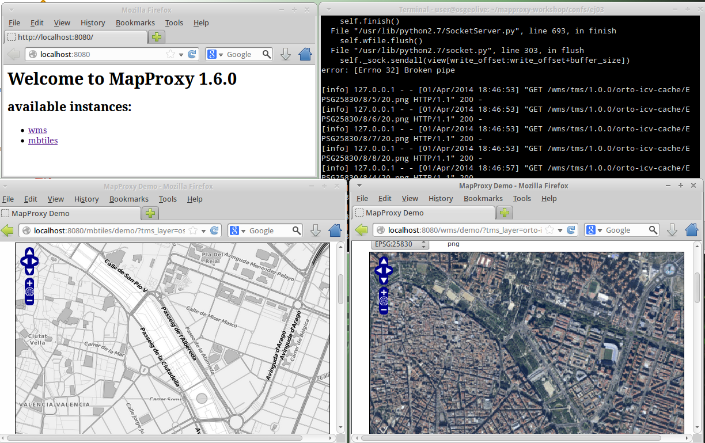

.. _ejer04:

=========================================
Ejecutar MapProxy en modo *multiapp*
=========================================

MapProxy dispone de un modo *­«multiaplicación»*, esto es, que permite disponer
de varias configuraciones ejecutándose en un mismo servidor. Este mecanismo
permite por tanto, crear varias configuraciones para diferentes propósitos y
publicarlas por separado.

Así, donde antes teníamos la url del servicio WMS como::

  http://www.miservidor.com/service

Ahora podemos tener algo como::

  http://www.miservidor.com/config1/service
  http://www.miservidor.com/config2/service
  http://www.miservidor.com/config1x/service

Donde las rutas ``config1``, ``config2``, etc. se corresponden con los nombres
de los ficheros :file:`config1.yaml`, :file:`config2.yaml`, etc. que deberán
estar en la misma carpeta.

Preparación de la carpeta de configuraciones
-----------------------------------------------

Dirígete a la carpeta donde has realizado el ejercicio :ref:`ejer03`::

    $ cd /home/user/mapproxy-workshop/confs/ej03

Deberías tener un fichero :file:`mapproxy.yaml` y la carpeta :file:`cache_data`
tal como se puede ver en la figura :ref:`fig01`.

.. _fig01:

   Carpeta del ejercicio del MBTiles

A continuación renombra el fichero de :file:`mapproxy.yaml` a
:file:`mbtiles.yaml`. Puedes usar la consola con el comando :command:`mv` o
usar el explorador de ficheros.

Finalmente copia el fichero del ejercicio :ref:`ejer01` en la carpeta y
cámbiale el nombre a  :file:`wms.yaml`. La estructura de la carpeta debería
quedar como en la figura :ref:`fig02`.

.. _fig02:

     Carpeta con dos ficheros de configuración

Ejectuar el servidor de desarrollo en modo *multiapp*
---------------------------------------------------------

Una vez tenemos en la carpeta los dos ficheros que queremos servir solo queda arrancar el servidor de desarrollo indicando que vamos a usar el modo *multiapp* y pasar como parámetro la carpeta donde tenemos los ficheros::

  (venv)$ mapproxy-util serve-multiapp-develop /home/user/mapproxy-workshop/confs/ej03/

Si nos dirijimos a la dirección `http://localhost:8080 <http://localhost:8080>`_ ahora veremos una lista de las instancias disponibles y podremos acceder a las páginas de demostración de cada una de ellas tal y como se muestra en la figura :ref:`fig03`.

.. _fig03:

     Modo *multiapp* de MapProxy
