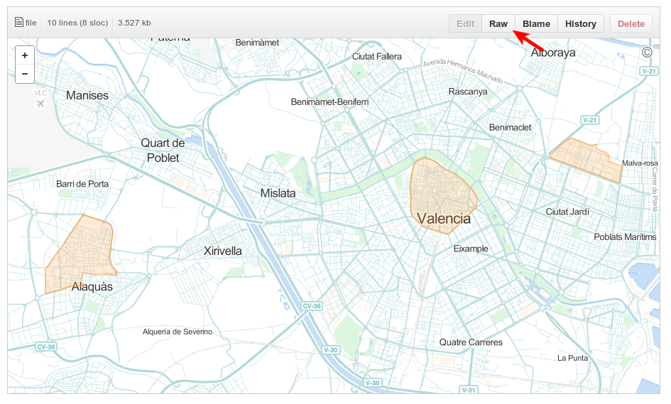
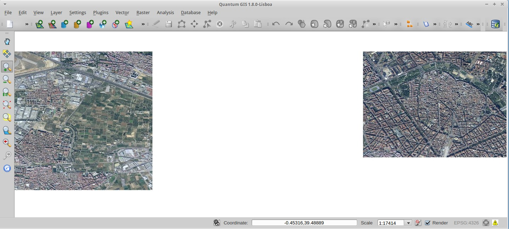

.. _ejer06:

=============================
Usar datos GIS en coberturas
=============================

Recordando la figura :ref:`mcmapproxy` vemos que la sección ``coverage`` es
usada tanto por orígenes de datos como por las tareas de *seeding* y
*cleanup*. Es decir podemos definir el ámbito geográfico que afecta a nuestros
orígenes de datos y también definir las zonas para las cuales queremos hacer
un sembrado o purgado concreto.

Hasta ahora estas coberturas han sido rectangulares, usando la etiqueta
``bbox``. MapProxy soporta más formas de definir el área geográfica de estas
coberturas (más detalles en la `documentación`_):

* Un fichero de texto con la geometría en formato `WKT <https://en.wikipedia.org/wiki/Well_Known_Text#Geometric_objects>`_
  (*Well Known Text*). MapProxy además proporciona un `índice <http://mapproxy.org/static/polygons/>`_
  de ficheros con los límites de países en coordenadas ``EPSG:3857``.

* Cualquier origen de datos soportado por la biblioteca `OGR <http://www.gdal.org/ogr/>`_.
  Esta biblioteca soporta `decenas de formatos <http://www.gdal.org/ogr/ogr_formats.html>`_,
  incluyendo los formatos de fichero más habituales, bases de datos
  con soporte geoespacial, etc. Además para este tipo de origen es posible definir una
  cláususa que filtre las geometrías.

Preparar la configuración de una capa WMS
--------------------------------------------

Para hacer este ejercicio crearemos una nueva carpeta y copiaremos el fichero resultado
del primer ejercicio :ref:`ejer01`::

    $ cd /home/user/mapproxy-workshop/confs/
    $ mkdir ej06
    $ cp /home/user/mapproxy-workshop/confs/ej01/mapproxy.yaml ej06

A continuación borraremos la información relativa a la capa *proxy* y la capa
de OSM dejando únicamente la capa de *cache* de la ortofoto, quedando algo
parecido a esto:

.. code-block:: yaml

    services:
      demo:
      kml:
      tms:
      wmts:
      wms:
        srs: ['EPSG:3857', 'EPSG:900913', 'EPSG:4258', 'EPSG:4326', 'EPSG:25830']
        image_formats: ['image/jpeg', 'image/png']
        md:
          title: Taller MapProxy
          abstract: Ejercicio de redireccion de leyenda e info por punto

    layers:
      - name: orto-icv-cache
        title: Ortofoto 1:5000 del ICV de la zona de Valencia (cacheado)
        sources: [icv_cache]

    caches:
      icv_cache:
        grids: [GLOBAL_MERCATOR, GLOBAL_GEODETIC]
        sources: [icv_wms]

    sources:
      icv_wms:
        type: wms
        supported_formats: ['image/jpeg']
        req:
          url: http://terramapas.icv.gva.es/odcv05_etrs89h30_2010
          layers: odcv05_etrs89h30_2010
        supported_srs: ['EPSG:4326', 'EPSG:25830']
        coverage:
          bbox: [-0.45, 39.26, -0.26, 39.56]
          bbox_srs: 'EPSG:4326'

Cambiar la cobertura para usar un fichero GeoJSON
----------------------------------------------------

El formato `GeoJSON <http://geojson.org>`_ es un formato de datos
geoespaciales en ficheros de texto apto para pequeños volúmenes de datos y
para usarse en visores *web*. Disponemos de un fichero que delimita algunas
zonas de interés, en concreto el casco urbano de Aldaia, el centro de la
ciudad de Valencia y el campus de Vera de la Universidad Politécnica de
Valencia. Queremos definir una *cache* de la ortofoto del ICV que solo
guarde y muestre imágenes que intersecten con estas zonas de interés.

.. _fig01:

   Polígonos que delimitan zonas de interés

Puedes ver el mapa de la figura :ref:`fig01` en el
`repositorio de datos del taller <https://github.com/geoinquietosvlc/mapproxy-workshop/blob/feature/cfp_2014/exercises/ogr/areas-interes.geojson>`_.
Descarga
el fichero en la carpeta del ejercicio pulsando el botón *Raw* o directamente
`aquí <https://github.com/geoinquietosvlc/mapproxy-workshop/raw/feature/cfp_2014/exercises/ogr/areas-interes.geojson>`_

El ejercicio por tanto consiste en cambiar las etiquetas ``bbox`` y ``bbox_srs`` por las
adecuadas para cargar el fichero :file:`areas-interes.geojson` estableciendo
su sistema de referencia a ``EPSG:4326``. Puedes ver ejemplos de este tipo
de configuración en la documentación_.

Al cargar la demostración de la capa se puede observar como no se cargan teselas
que no intersecten con las zonas de interés delimitadas. Hay que tener en cuenta
que en *zooms* bajos (escalas pequeñas) las teselas llegan a aparecer de forma
continua ya que las teselas de 256x256 píxeles intersectan con varios polígonos
a la vez.

.. _fig02:

   Caché con datos en zonas seleccionadas

.. _documentación: http://mapproxy.org/docs/latest/coverages.html