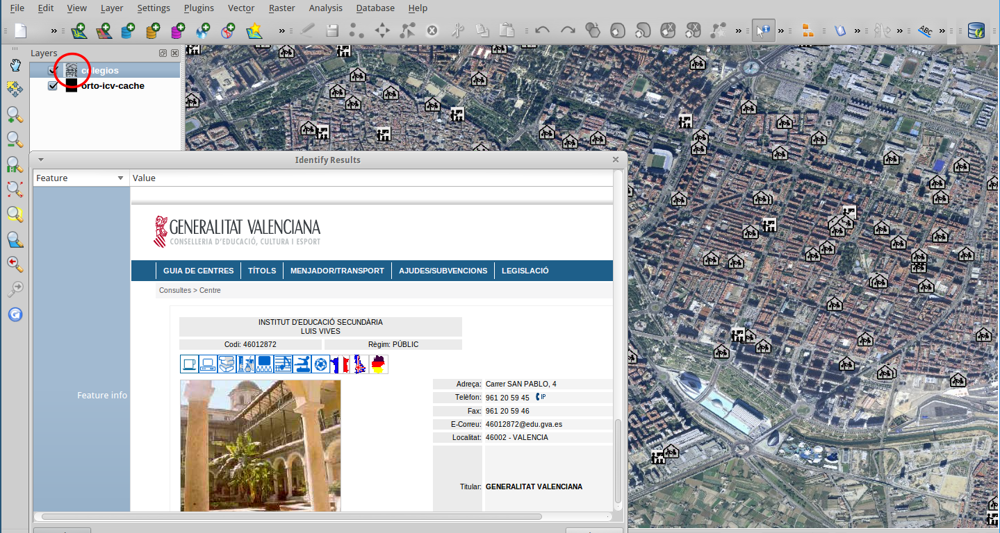

.. _ejer05:

=============================================================
Redirigir el ``getLegendgraphic`` y el ``getFeatureInfo``
=============================================================

El protocolo WMS dispone de dos peticiones adicionales a la petición de mapa
``getMap``, ``getLegendgraphic`` obtieneuna leyenda de la capa y con ``getFeatureInfo`` se pude solicitar información alfanumérica asociada a una posición en el mapa. MapProxy permite dar acceso a estas dos peticiones haciendo algo así como una *«redirección»*. Es decir estas peticiones no se guardan en ninguna *cache* y es necesario tener conexión con el servidor origen ya que en este caso MapProxy hace únicamente el papel de un *proxy*.

Preparar la configuración de una capa WMS
--------------------------------------------

Para hacer este ejercicio crearemos una nueva carpeta y copiaremos el fichero resultado del primer ejercicio :ref:`ejer01`::

    $ cd /home/user/mapproxy-workshop/confs/
    $ mkdir ej05
    $ cp /home/user/mapproxy-workshop/confs/ej01/mapproxy.yaml ej05

A continuación borraremos la información relativa a la capa *proxy* y la capa de OSM dejando únicamente la capa de cache de la Ortofoto, quedando algo parecido a esto:

.. code-block:: yaml

    services:
      demo:
      kml:
      tms:
      wmts:
      wms:
        srs: ['EPSG:3857', 'EPSG:900913', 'EPSG:4258', 'EPSG:4326', 'EPSG:25830']
        image_formats: ['image/jpeg', 'image/png']
        md:
          title: Taller MapProxy
          abstract: Ejercicio de redireccion de leyenda e info por punto

    layers:
      - name: orto-icv-cache
        title: Ortofoto 1:5000 del ICV de la zona de Valencia (cacheado)
        sources: [icv_cache]

    caches:
      icv_cache:
        grids: [GLOBAL_MERCATOR, GLOBAL_GEODETIC]
        sources: [icv_wms]

    sources:
      icv_wms:
        type: wms
        req:
          url: http://terramapas.icv.gva.es/odcv05_etrs89h30_2010
          layers: odcv05_etrs89h30_2010
        supported_srs: ['EPSG:4326', 'EPSG:25830']
        coverage:
          bbox: [-0.45, 39.26, -0.26, 39.56]
          bbox_srs: 'EPSG:4326'

Añadiremos a la lista de *sources* una capa WMS que apunta al servidor de centros educativos del ICV:

.. code-block:: yaml

      coles_wms:
        type: wms
        req:
          url: http://terramapes.edu.gva.es/edugva
          layers: edu_centres
          transparent: true
        supported_srs: ['EPSG:4326', 'EPSG:25830']
        coverage:
          bbox: [-0.45, 39.26, -0.26, 39.56]
          bbox_srs: 'EPSG:4326'

.. note:: Recuerda añadir el resto de componentes a la configuración, no solo el *source*.

Añadir las opciones para pedir la leyenda e información por punto
------------------------------------------------------------------------

Siguiendo la `documentación del origen WMS <http://mapproxy.org/docs/latest/sources.html#wms-opts>`_,
para poder redireccionar las peticiones de leyenda e información por punto
debemos añadir una nueva sección al *source* llamada ``wms_opts`` y en ella
establecer las variables ``legendgraphic`` y ``featureinfo`` a verdadero.

Una vez establecidas podemos cargar las capas por separado en un SIG de escritorio como QGIS y comprobar que se carga la leyenda automáticamente (junto al nombre de la capa) y que podemos realizar la operación de información por punto, que en esta capa devuelve un documento HTML con completa información sobre el colegio seleccionado, tal y como se muestra en la figura :ref:`fig01`.

.. _fig01:

   Capa WMS de MapProxy con leyenda y soporte al ``getFeatureInfo``