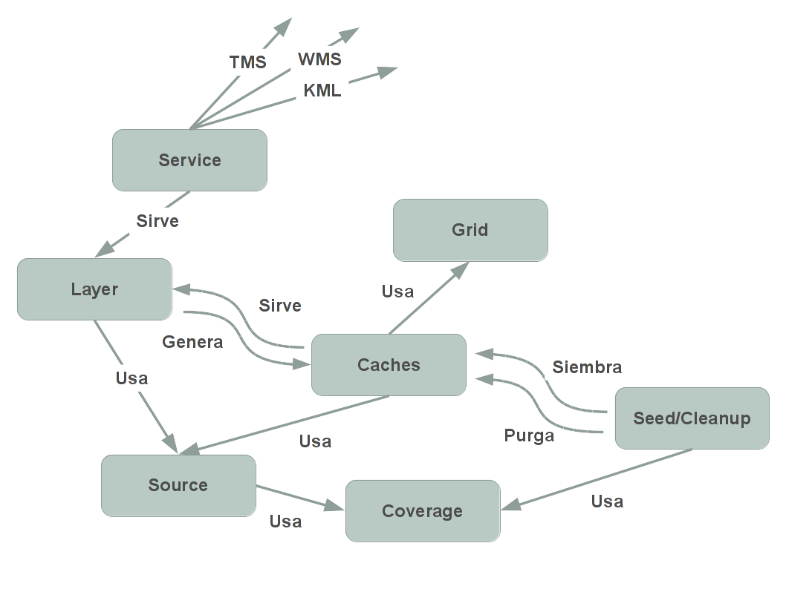

.. _elarchivodeconfig:

=====================================================
El archivo de configuración :file:`mapproxy.yaml`
=====================================================

Introducción
=====================

Las diferentes funcionalidades de MapProxy se configuran a través de archivos
*YAML*, un estandar de serialización de datos que se emplea en diversos
lenguajes de programación.

MapProxy se configura a través de los archivos :file:`mapproxy.yaml` y
:file:`seed.yaml`, definiendo para cada archivo una serie de secciones y de
directivas en las secciones. Estos nombres de fichero son solo una propuesta,
desde luego se pueden elegir otros que se adecuen a nuestro proyecto.

En la presente sección hablaremos solo del archivo principal de configuración
:file:`mapproxy.yaml`. Dejaremos el archivo :file:`seed.yaml` para la sección
:ref:`elarchivodeseeding`.

Es muy importante respetar la indentación en los archivos, y esta debe
realizarse con **espacios** y **NUNCA** con tabuladores.

Para seguir el taller crearemos un proyecto llamado *valencia01* y editaremos el
contenido de su archivo :file:`mapproxy.yaml`::

    $ cd /home/user/mapproxy-workshop/confs/
    $ mapproxy-util create -t base-config valencia01
    $ cd valencia01
    $ leafpad mapproxy.yaml &

.. note:: :command:`leafpad` es un editor de texto disponible en *OSGeo Live*.
          Puedes usar cualquier editor de ficheros de texto plano para trabajar
          con ficheros :file:`.yaml` siempre y cuando se respete el uso de
          espacios y la codificación de caracteres.

:file:`mapproxy.yaml`
=======================

El archivo está compuesto de las siguientes secciones

**services:**
    Definición de los servicios que se van a ofrecer.

**layers:**
    Definición de las capas que se servirán. Cada capa puede estar constituida por varias *sources* y *caches*

**caches:**
    En esta sección se configuran las cachés internas de los servicios.

**sources:**
    Definición de los orígenes de datos de los servicios.

**grids:**
    En esta sección se definen las rejillas sobre las que se alinean las imágenes que genera MapProxy.

**globals:**
    En esta sección generalmente se definen parámetros que son comunes a todas las secciones.

El orden en el que aparecen las secciones **no** es importante.

El archivo puede subdividirse en varios archivos utilizando la directiva
**base** (`documentación <http://mapproxy.org/docs/1.6.0/configuration.html#base>`_).

Relación entre los componentes
===================================

Para tener una idea global de cómo interrelacionan los distintos componentes de
MapProxy podemos consultar el mapa conceptual de la figura :ref:`mcmapproxy`.

.. _mcmapproxy:

   Mapa conceptual de interrelacion entre los componentes de MapProxy

services
=========

MapProxy puede generar los siguientes tipos de servicio:

* Web Map Service (OGC WMS) y WMS-C [**wms**]
* Tiled Map Services (TMS) [**tms**]
* Keyhole Markup Language (OGC KML) [**kml**]
* Web Map Tile Services (WMTS) [**wmts**]
* MapProxy Demo Service [**demo**]

Para cada uno se emplea su propia clave, que aparece listada entre corchetes, y
en algunos casos se pueden configurar opciones adicionales.

Para el presente taller utilizaremos el servicio *wms* que se configura
indicando los sistemas de referencia en los que se va a servir (**srs**), los
formatos de imagen (**image_formats**) y metadatos adicionales (**md**):

Remplaza el contenido de la sección *services* por el contenido que hay a
continuación:

.. code-block:: yaml

    services:
      wms:
        srs: ['EPSG:3857', 'EPSG:900913', 'EPSG:4258', 'EPSG:4326', 'EPSG:25830']
        image_formats: ['image/jpeg', 'image/png']
        md:
          # metadata used in capabilities documents
          title: Taller MapProxy
          abstract: Ejercicio de aceleración de WMS y OSM con MapProxy
          online_resource: http://localhost:8080/service
          contact:
            person: Pedro-Juan Ferrer, Iván Sánchez y Jorge Sanz
            position: Facilitadores
            organization: Geoinquietos Valencia
            email: pferrer@osgeo.org , jsanz@osgeo.org y ivan@sanchezortega.es
          access_constraints:
            Este servicio tiene únicamente objetivos educativos.
          fees: 'None'

Puede encontrarse una descripción más completa de las claves y opciones de los
servicios en `la página de documentación de services de MapProxy`_

layers
========

Las capas definen la información que MapProxy proporciona y están formadas por
una lista (una lista de *YAML*) de pares clave - valor.

La información mínima que se requiere es el nombre (**name**) como identificador
único, el título (**title**) como pequeña descripción y el origen u orígenes de
datos (del propio archivo de MapProxy) que la conforman (**source**):

Remplaza el contenido de la sección *layers* por el contenido que hay a
continuación:

.. code-block:: yaml

    layers:
      - name: orto-icv
        title: Ortofoto 1:5000 del ICV de la zona de Valencia
        sources: [icv_cache]

Puede encontrarse más información sobre las capas así como otros parámetros configurables de las mismas en `la sección de layers de la página de configuración de la documentación de MapProxy`_

caches
=======

En *caches* se configura la manera en la que se almacena una copia de la
información en disco, para no tenerla que volver a pedir al servidor. La
información que hay que proporcionar en este caso es el origen de datos
(**sources**) y el grid o grids (**grids**) sobre los que queremos guardar los
cachés. En caso de haber varios grids se creará una caché separada por cada capa
y cada *grid*

Remplaza el contenido de la sección *caches* por el contenido que hay a continuación:

.. code-block:: yaml

    caches:
      icv_cache:
        grids: [utm_valencia]
        sources: [icv_wms]

Puede encontrarse más información sobre las caches así como otros parámetros configurables de los mismos en `la sección de caches de la página de configuración de la documentación de MapProxy`_

sources
=========

En esta sección se definen los diferentes orígenes de datos de los servicios que ofrece el archivo de MapProxy, se define el nombre del origen de datos y se configuran parámetros del mismo como el tipo (**type**) del que admite *wms*, *tiles*, *mapserver*, *mapnik* y *debug*. Cada tipo tiene sus propias configuraciones.

Remplaza el contenido de la sección *sources* por el contenido que hay a continuación:

.. code-block:: yaml

    sources:
      icv_wms:
        type: wms
        req:
          url: http://terramapas.icv.gva.es/odcv05_etrs89h30_2010
          layers: odcv05_etrs89h30_2010
        supported_srs: ['EPSG:4326', 'EPSG:25830']
        coverage:
          bbox: [-0.45, 39.26, -0.26, 39.56]
          bbox_srs: 'EPSG:4326'

Puede encontrarse una descripción más completa de las claves de cada tipo en `la página de sources de la documentación de MapProxy`_

grids
=======

La sección de grids define las rejillas que emplea MapProxy a nivel interno para
almacenar las imágenes generadas. Hay varias opciones de configuración, muchas
pueden emplearse simultáneamente aunque tengan efectos contradictorios y
produzcan resultados ambiguos.

En general lo mínimo a definir *debería* ser el nombre, el sistema de referencia
(**srs**), el *bounding box* (**bbox**) y las resoluciones (**min_res** y
**max_res**) aunque en los grids que están basados en otros grids la lista de
parámetros puede ser menor.

Remplaza el contenido de la sección *grids* por el contenido que hay a continuación:

.. code-block:: yaml

   grids:
     utm_valencia:
       srs: 'EPSG:25830'
       bbox: [-0.45, 39.26, -0.26, 39.56]
       bbox_srs: 'EPSG:4326'
       min_res: 2000
       max_res: .5

.. attention:: La resolución se mide en unidades del SRS por pixel. Como estamos
   usando EPSG:25831, que es una proyección UTM, podemos suponer que la
   resolución mínima es de 2000 metros/pixel y la máxima de 50 cm/pixel.

Se puede consultar más información sobre las claves en la `sección de grids de la página de configuración de la documentación de MapProxy`_

globals
=========

En esta sección se colocan directivas y claves que son comunes a todas las otras
secciones o son internas de MapProxy.

.. code-block:: yaml

    globals:
      cache:
        base_dir: 'cache_data'
        lock_dir: 'cache_data/locks'

      image:
          resampling_method: bilinear
          jpeg_quality: 90

.. attention:: Si el directorio de caché no empieza por una barra "/", se supone
   que es un directorio *relativo* a donde se encuentre el fichero
   ``mapproxy.yaml``.

Una vez más hay amplia información sobre las claves y directivas en la `sección de globals de la página de configuración de la documentación de MapProxy`_

.. _la página de documentación de services de MapProxy: http://mapproxy.org/docs/1.6.0/services.html
.. _la sección de layers de la página de configuración de la documentación de MapProxy: http://mapproxy.org/docs/1.6.0/configuration.html#layers
.. _la sección de caches de la página de configuración de la documentación de MapProxy: http://mapproxy.org/docs/1.6.0/configuration.html#caches
.. _la página de sources de la documentación de MapProxy: http://mapproxy.org/docs/1.6.0/sources.html
.. _sección de globals de la página de configuración de la documentación de MapProxy: http://mapproxy.org/docs/1.6.0/configuration.html#globals
.. _sección de grids de la página de configuración de la documentación de MapProxy: http://mapproxy.org/docs/1.6.0/configuration.html#id5
