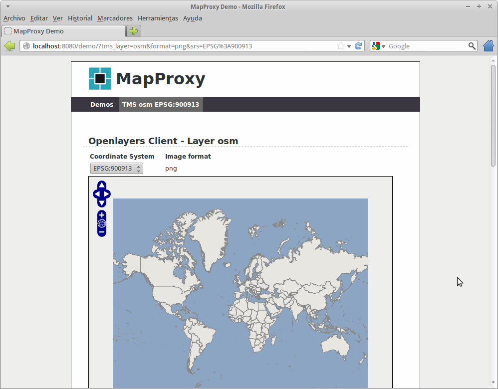

Instalación de MapProxy
=================================================

.. note:: El sigiente proceso de intsalación está orientado a una máquina GNU/Linux de tipo Debian/Ubuntu o similar.

Descarga de dependencias del sistema
---------------------------------------------------

Instalar paquetes iniciales::

  $ sudo apt-get install git tree python-virtualenv

.. note:: Las líneas de esta documentación que comiencen con el símbolo
          del dólar indican instrucciones a ejecutar en una consola
          del sistema. Si vas a copiar estas líneas en tu consola debes hacerlo
          **sin incluir el dólar**.

Instalar dependencias de MapProxy::

  $ sudo apt-get install python-imaging \
    python-yaml libproj0 libgeos-dev python-lxml libgdal-dev \
    python-shapely build-essential python-dev libjpeg-dev \
    zlib1g-dev libfreetype6-dev

Esto descargará unas 200MB en binarios, tardará un buen rato...  A partir de
aquí todo se ejecuta como un usuario normal.

Como instalar MapProxy
---------------------------------------------------

Primero vamos a descargar los materiales del taller. En el home del usuario
ejecutar::

  $ wget -O mapproxy-workshop/mapproxy-workshop.pdf "http://bit.ly/mapproxy-workshop"

..  $ git clone https://github.com/geoinquietosvlc/mapproxy-workshop.git

Con esto tendremos una nueva carpeta ``mapproxy-worksop`` con el documento pdf
del taller así como los ejercicios resueltos, etc.

Moverse a la carpeta creada y crear el entorno virtual con::

  $ virtualenv venv

Activar el entorno virtual con::

  $ source venv/bin/activate

.. note:: Una vez activado el entorno virtual nos aparecerá entre paréntesis en
          el símbolo del sistema el nombre del mismo. Se indica igualmente
          en estas instrucciones para recordarlo.

Instalar la librería de tratamiento de imágenes PIL con::

  (venv)$ pip install https://bitbucket.org/olt/pil-2009-raclette/get/default.tar.gz

Y ya podemos instalar MapProxy::

  (venv)$ pip install MapProxy

Al finalizar podremos comprobar que MapProxy está instalado usando la
instrucción ``mapproxy-util``::

  (venv)$ mapproxy-util --version
  MapProxy 1.5.0

Crear un proyecto de demostración
------------------------------------------

Para comprobar que MapProxy está funcionando correctamente vamos a crear un
proyecto de ejemplo y lo arrancaremos con el servidor de pruebas que MapProxy
incorpora. Para ello, nos colocaremos en la carpeta raíz del taller y crearemos
la carpeta ``confs``. Nos movemos a esa carpeta y ejecutamos la herramienta que
MapProxy incorpora para diferentes tareas ``mapproxy-util``.::

	(venv)$ mapproxy-util create -t base-config test
	writing test/mapproxy.yaml
	writing test/seed.yaml

Esta instrucción ha creado la carpeta ``test`` y dentro de ella dos ficheros de
configuración que veremos en la siguiente parte del taller. El fichero
``mapproxy.yaml`` configura el servidor de teselas y ``seed.yaml`` las tareas de
pregeneración y/o limpieza de teselas.

Para ejecutar el servidor de pruebas se utilizará de nuevo ``mapproxy-util``
esta vez con la tarea de arrancar el servidor de pruebas.::

  (venv)$ cd test
  (venv)$ mapproxy-util serve-develop mapproxy.yaml
  [2012-12-06 17:20:09,814] mapproxy.config - INFO - reading: /home/user/mapproxy-workshop/confs/test/mapproxy.yaml
  [2012-12-06 17:20:09,907] mapproxy.service.wmts - WARNING - grid 'global_geodetic_sqrt2' is not compatible with WMTS, skipping for layer 'osm'
  [2012-12-06 17:20:09,909] mapproxy.service.wmts - WARNING - grid 'global_geodetic_sqrt2' is not compatible with WMTS, skipping for layer 'osm'
  [info]  * Running on http://127.0.0.1:8080/
  [info]  * Restarting with reloader: stat() polling
  [2012-12-06 17:20:10,234] mapproxy.config - INFO - reading: /home/user/mapproxy-workshop/confs/test/mapproxy.yaml
  [2012-12-06 17:20:10,321] mapproxy.service.wmts - WARNING - grid 'global_geodetic_sqrt2' is not compatible with WMTS, skipping for layer 'osm'
  [2012-12-06 17:20:10,324] mapproxy.service.wmts - WARNING - grid 'global_geodetic_sqrt2' is not compatible with WMTS, skipping for layer 'osm'

Si nos dirigimos con nuestro navegador a la dirección web http://localhost:8080
podremos ver un mensaje de bienvenida y si hacemos clic en el enlace *demo*
MapProxy nos mostrará su interfaz de demostración de servicios. En esta página
podemos ver diferentes enlaces a ficheros de capacidades y a visores. Podemos
probar con el servicio **TMS** y ver la capa ``osm`` en el sistema de
coordenadas ``EPSG:900913`` en formato ``png``.

	 Interfaz de demostración de MapProxy

Esta interfaz además de permitir navegar por la cartografía, ofrece información
adicional sobre la *cache* como las coordenadas de sus límites, los niveles de
resolución así como el código mínimo necesario para cargar dicha capa usando la
biblioteca de *webmapping* `OpenLayers <http://www.openlayers.org>`_.

.. note:: Para apagar el servidor de pruebas se debe pulsar la combinación de
					teclas ``Control+C``.

Finalmente, podemos comprobar cómo el servidor ha guardado algunas teselas al
visitar la demostración en la carpeta ``confs/test/cache_data`` que podemos ver
desde la consola si navegamos hasta esa carpeta y ejecutamos el comando
``tree``.::

  $ tree -d -L 3
  .
  └── osm_cache_EPSG900913
      ├── 01
      │   └── 000
      ├── 03
      │   └── 000
      ├── 05
      │   └── 000
      ├── 07
      │   └── 000
      └── tile_locks

Como vemos ha creado una carpeta para la *cache* de la capa ``osm`` y una
estructura de carpetas donde se almacenan las imágenes.

.. attention:: ¿Qué tamaño tienen las imágenes? ¿En qué formato están?

